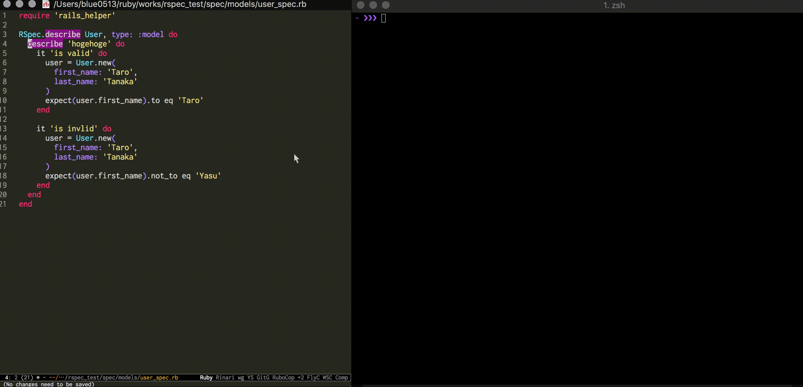

# Rspec on iTerm2

Execute Rspec on iTerm2 using Emacs!!

## How It Works

1. Set the cursor on the line you want to test, in your spec.rb file.
2. `M-x send-executable-text-to-iterm`



## Usage

In your `init.el`,

```elisp
(add-to-list 'load-path "YOUR PATH")
(require 'rspec-on-iterm)

;; if you like to bind the key
(global-set-key [YOUR FAV KEY] 'send-executable-text-to-iterm)
(global-set-key [YOUR FAV KEY] 'copy-executable-text-to-iterm)
```
